# **SupportDeskPro – Test Evidence**

**Link**: https://supportdeskpro-api.victoriousdune-73ebad30.westus.azurecontainerapps.io/swagger/index.html

## **Admin**
### **Login**

 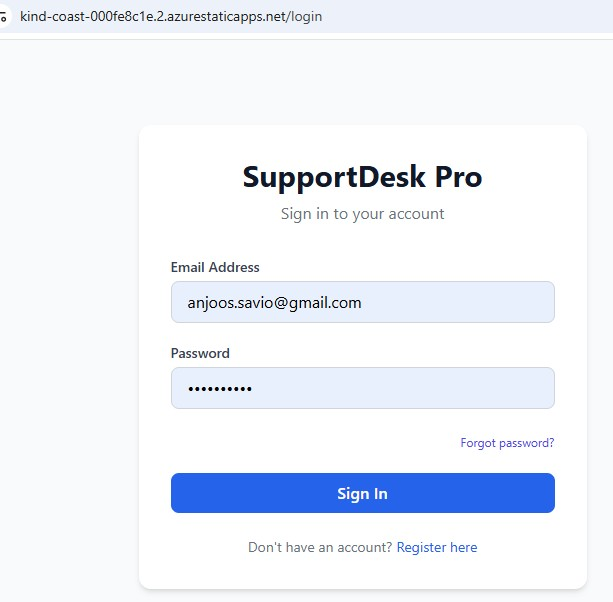

Request URL: https://supportdeskpro-api.victoriousdune-73ebad30.westus.azurecontainerapps.io/api/auth/login

Request Method: POST

Request Payload: {"email":"anjoos.savio@gmail.com","password":"Admin@1234"}

Response:
```
{
    "success": true,
    "data": {
        "accessToken": "eyJhbGciOiJIUzI1NiIsInR5cCI6IkpXVCJ9.eyJodHRwOi8vc2NoZW1hcy54bWxzb2FwLm9yZy93cy8yMDA1LzA1L2lkZW50aXR5L2NsYWltcy9uYW1laWRlbnRpZmllciI6IjI4ZThlMTM4LTU4NGMtNDQ1Ny04MzY2LTIyMmMxYTZlNjBlMSIsImh0dHA6Ly9zY2hlbWFzLnhtbHNvYXAub3JnL3dzLzIwMDUvMDUvaWRlbnRpdHkvY2xhaW1zL2VtYWlsYWRkcmVzcyI6ImFuam9vcy5zYXZpb0BnbWFpbC5jb20iLCJodHRwOi8vc2NoZW1hcy5taWNyb3NvZnQuY29tL3dzLzIwMDgvMDYvaWRlbnRpdHkvY2xhaW1zL3JvbGUiOiJBZG1pbiIsImh0dHA6Ly9zY2hlbWFzLnhtbHNvYXAub3JnL3dzLzIwMDUvMDUvaWRlbnRpdHkvY2xhaW1zL2dpdmVubmFtZSI6IkFuanUiLCJodHRwOi8vc2NoZW1hcy54bWxzb2FwLm9yZy93cy8yMDA1LzA1L2lkZW50aXR5L2NsYWltcy9zdXJuYW1lIjoiU2F2aW8iLCJUZW5hbnRJZCI6IjcyNjRmZDMwLTAyYzMtNGNiNy1iYmQ5LTA2ZDFkMmRlM2U0NCIsIlRlbmFudE5hbWUiOiJBY21lIENvcnAiLCJqdGkiOiI1MTdlZTg3Yi03MDhhLTQ0MzYtYjJkZi0xOTJmNGY0MGY3YzgiLCJleHAiOjE3NzUxNTc1MTAsImlzcyI6IlN1cHBvcnREZXNrUHJvIiwiYXVkIjoiU3VwcG9ydERlc2tQcm8ifQ.5s43RPGG9q0EIq0QYB2d-TB9b-QoM1YMK8VTn5BaZw8",
        "refreshToken": "9qCtOq+p4fls+9cjt+BgTIiSyhmKoWwK9hdQZV3Vt8Sllm9kPqANatteBpmQ2qK8QjdchxFZowwZG4hRJQWjHQ==",
        "expiresIn": 900,
        "user": {
            "id": "28e8e138-584c-4457-8366-222c1a6e60e1",
            "firstName": "Anju",
            "lastName": "Savio",
            "email": "anjoos.savio@gmail.com",
            "role": "Admin",
            "tenantId": "7264fd30-02c3-4cb7-bbd9-06d1d2de3e44",
            "tenantName": "Acme Corp"
        }
    },
    "message": null,
    "errors": null,
    "pagination": null
}
```

 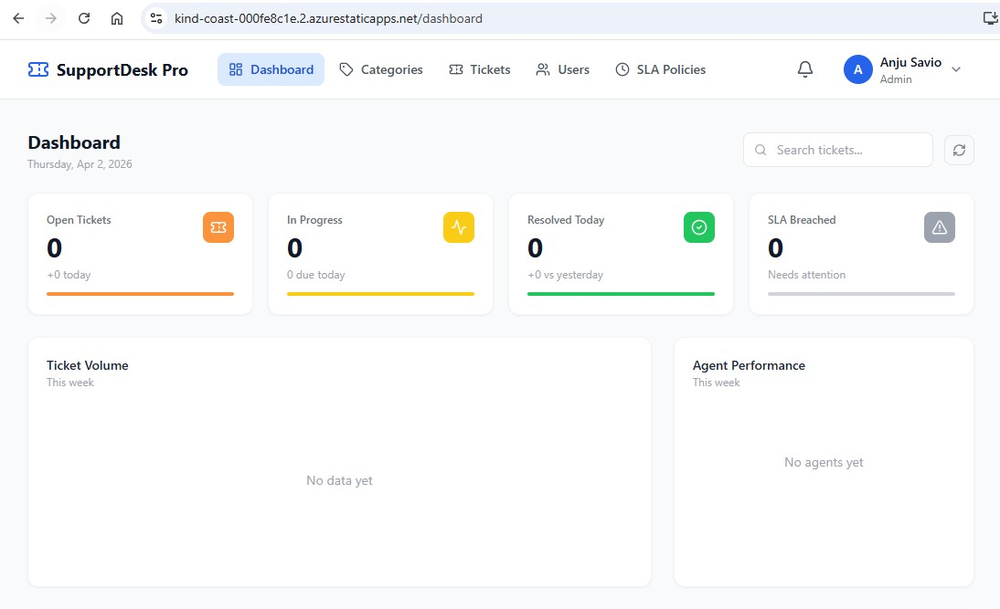

### **Change Password**
 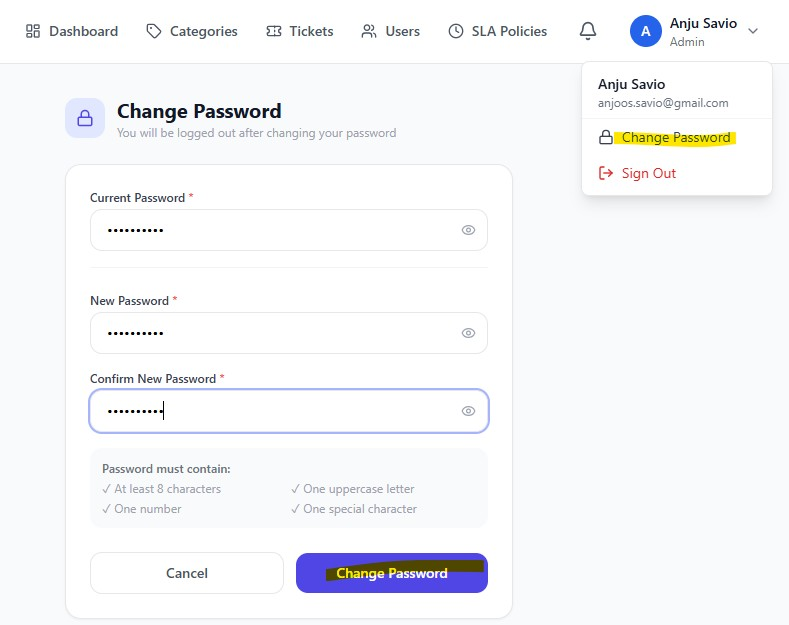

 
Request URL: https://supportdeskpro-api.victoriousdune-73ebad30.westus.azurecontainerapps.io/api/auth/change-password

Request Method: POST

Request Payload: 

```
{"currentPassword":"Admin@1234","newPassword":"Admin@123","confirmPassword":"Admin@123"}
```

Response:
```
{
    "success": true,
    "data": "Password changed successfully.",
    "message": null,
    "errors": null,
    "pagination": null
}
```
 
### **Forgot Password**
 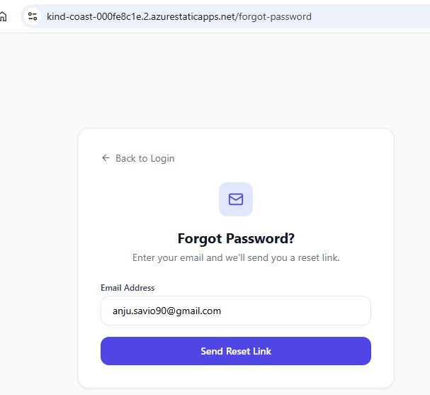


Request URL: https://supportdeskpro-api.victoriousdune-73ebad30.westus.azurecontainerapps.io/api/auth/forgot-password

Request Method: POST

Request Payload:
 ```
{"email":"anju.savio90@gmail.com"}
```

Response: 
```
{
    "success": true,
    "data": "If an account exists with this email, a reset link has been sent.",
    "message": null,
    "errors": null,
    "pagination": null
}
```
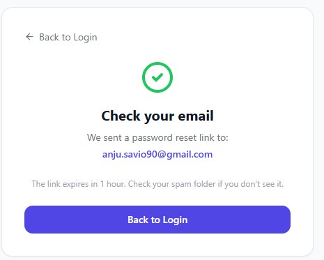

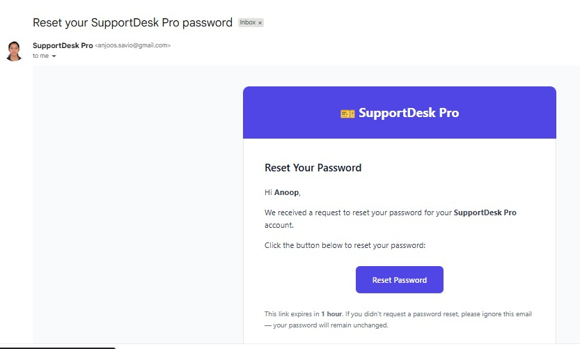
         

  ### **Reset Password**

   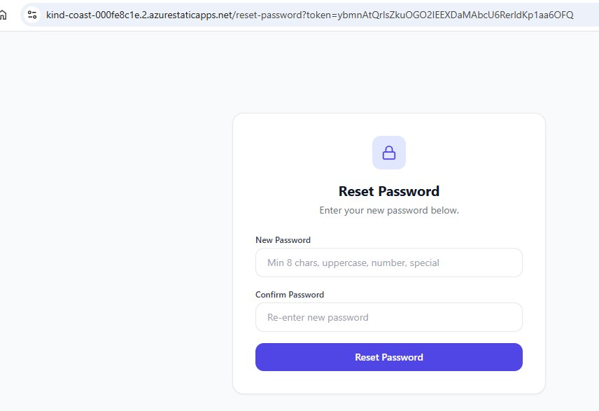


Request URL: https://kind-coast-000fe8c1e.2.azurestaticapps.net/reset-password?token=ybmnAtQrIsZkuOGO2IEEXDaMAbcU6RerldKp1aa6OFQ

Request Method: GET

Response:

```
<!doctype html>
<html lang="en">
    <head>
        <meta charset="utf-8"/>
        <link rel="icon" href="/favicon.ico"/>
        <meta name="viewport" content="width=device-width,initial-scale=1"/>
        <meta name="theme-color" content="#000000"/>
        <meta name="description" content="Web site created using create-react-"/>
        <link rel="apple-touch-icon" href="/logo192.png"/>
        <link rel="manifest" href="/manifest.json"/>
        <title>SupportDesk Pro</title>
        <script defer="defer" src="/static/js/main.42849afa.js"></script>
        <link href="/static/css/main.a7e000a3.css" rel="stylesheet">
    </head>
    <body>
        <noscript>You need to enable JavaScript to run this app.</noscript>
        <div id="root"></div>
    </body>
</html>
```
Request URL: https://supportdeskpro-api.victoriousdune-73ebad30.westus.azurecontainerapps.io/api/auth/reset-password

Request Method: POST

Request Payload: 

```
{"token":"ybmnAtQrIsZkuOGO2IEEXDaMAbcU6RerldKp1aa6OFQ","newPassword":"Anoop@1234","confirmPassword":"Anoop@1234"}
```

Response:
```
{
    "success": true,
    "data": "Password reset successfully. You can now login.",
    "message": null,
    "errors": null,
    "pagination": null
}
```
### **Categories**

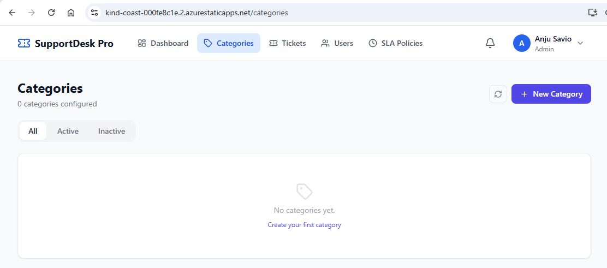

#### **Create Parent Category**

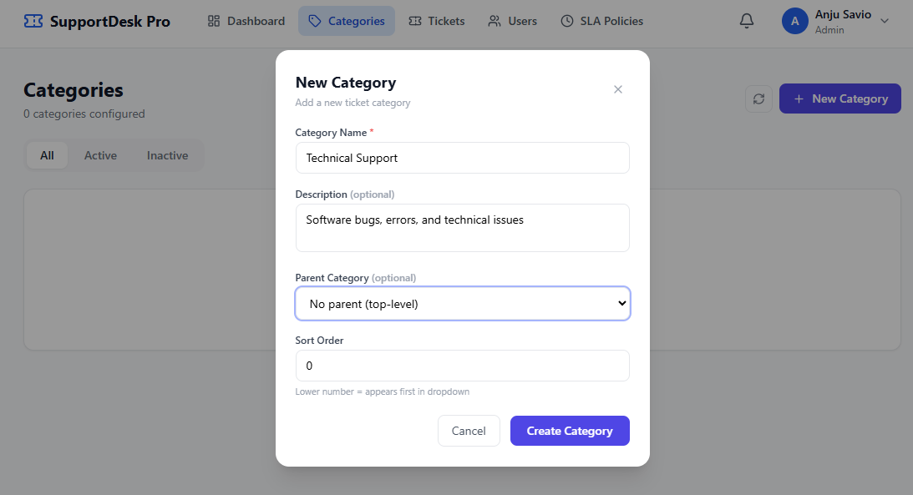

Request URL: https://supportdeskpro-api.victoriousdune-73ebad30.westus.azurecontainerapps.io/api/categories

Request Method: POST

Request Payload: 
```
{"name":"Technical Support","description":"Software bugs, errors, and technical issues","parentCategoryId":null,"sortOrder":0}
```

Response: 
```
{
    "success": true,
    "data": "4a352e73-649f-4b30-abd1-1835207847d5",
    "message": "Category created successfully.",
    "errors": null,
    "pagination": null
}
```

#### **Get Category**

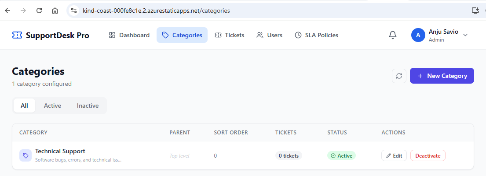

Request URL: https://supportdeskpro-api.victoriousdune-73ebad30.westus.azurecontainerapps.io/api/categories?page=1&pageSize=20

Request Method: GET

Response:
```
{
    "success": true,
    "data": {
        "items": [
            {
                "id": "4a352e73-649f-4b30-abd1-1835207847d5",
                "name": "Technical Support",
                "description": "Software bugs, errors, and technical issues",
                "parentCategoryId": null,
                "parentCategoryName": null,
                "sortOrder": 0,
                "isActive": true,
                "ticketCount": 0
            }
        ],
        "totalCount": 1,
        "page": 1,
        "pageSize": 20
    },
    "message": null,
    "errors": null,
    "pagination": null
}
```

#### **Create Sub Category**

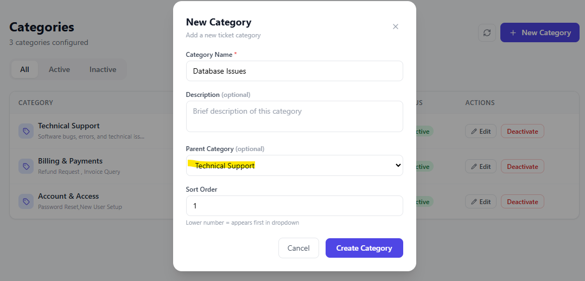

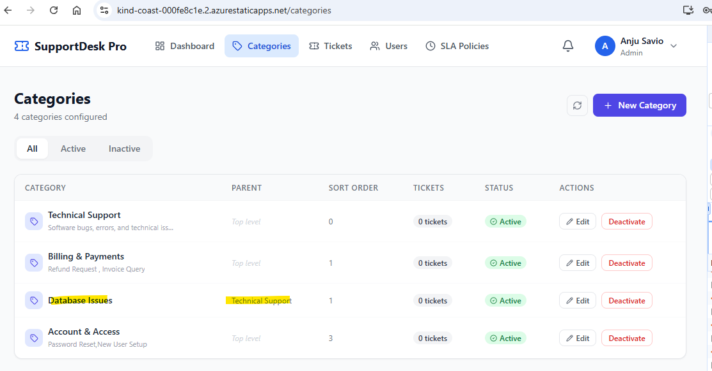
#### **Edit Category**

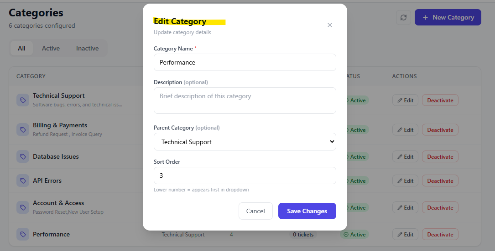
Request URL: https://supportdeskpro-api.victoriousdune-73ebad30.westus.azurecontainerapps.io/api/categories/a8c5cbb6-cc97-4a7e-ac2c-94f9ee19668b

Request Method: PUT

Request Payload: 
```
{"name":"Performance","description":null,"parentCategoryId":"4a352e73-649f-4b30-abd1-1835207847d5","sortOrder":3}
```

Response:
```
{
    "success": true,
    "data": "Category updated successfully.",
    "message": null,
    "errors": null,
    "pagination": null
}
```
#### **Deactivate**
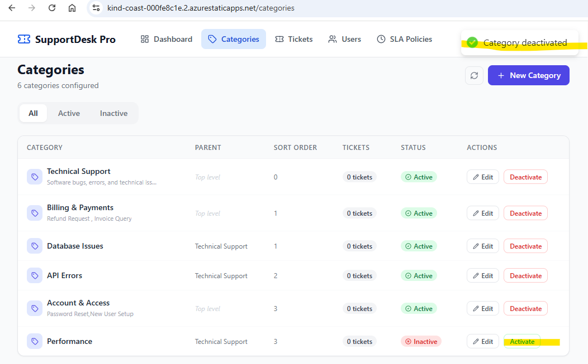

Request URL: https://supportdeskpro-api.victoriousdune-73ebad30.westus.azurecontainerapps.io/api/categories/a8c5cbb6-cc97-4a7e-ac2c-94f9ee19668b/status

Request Method: PATCH

Request Payload: 
```
{"isActive":false}
```

Response:
```
{
    "success": true,
    "data": "Category deactivated successfully.",
    "message": null,
    "errors": null,
    "pagination": null
}
```
#### **Get Active Categories**

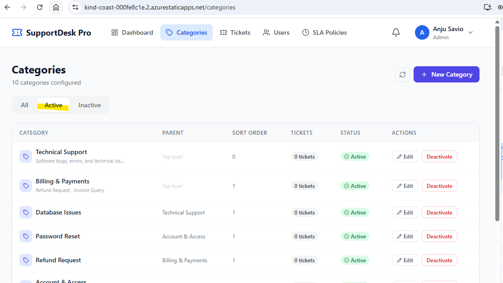

Request URL: https://supportdeskpro-api.victoriousdune-73ebad30.westus.azurecontainerapps.io/api/categories?page=1&pageSize=20&isActive=true

Request Method: GET

Response:
```
{
    "success": true,
    "data": {
        "items": [
            {
                "id": "4a352e73-649f-4b30-abd1-1835207847d5",
                "name": "Technical Support",
                "description": "Software bugs, errors, and technical issues",
                "parentCategoryId": null,
                "parentCategoryName": null,
                "sortOrder": 0,
                "isActive": true,
                "ticketCount": 0
            },
            {
                "id": "fe2f4fdc-35a6-48fa-a8f2-e1345b8096a0",
                "name": "Billing & Payments",
                "description": "Refund Request , Invoice Query",
                "parentCategoryId": null,
                "parentCategoryName": null,
                "sortOrder": 1,
                "isActive": true,
                "ticketCount": 0
            }
        ]
    }
}
```
#### **Get In-Active Categories**
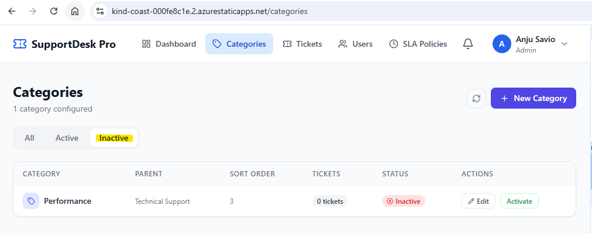

Request URL: https://supportdeskpro-api.victoriousdune-73ebad30.westus.azurecontainerapps.io/api/categories?page=1&pageSize=20&isActive=false

Request Method: GET

Response: 
```
{
    "success": true,
    "data": {
        "items": [
            {
                "id": "a8c5cbb6-cc97-4a7e-ac2c-94f9ee19668b",
                "name": "Performance",
                "description": null,
                "parentCategoryId": "4a352e73-649f-4b30-abd1-1835207847d5",
                "parentCategoryName": "Technical Support",
                "sortOrder": 3,
                "isActive": false,
                "ticketCount": 0
            }
        ],
        "totalCount": 1,
        "page": 1,
        "pageSize": 20
    },
    "message": null,
    "errors": null,
    "pagination": null
}
```

#### **Refresh Data**

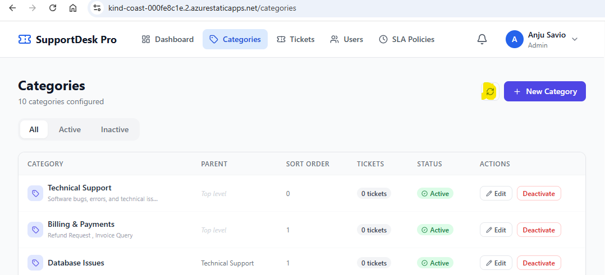

Request URL: https://supportdeskpro-api.victoriousdune-73ebad30.westus.azurecontainerapps.io/api/categories?page=1&pageSize=20

Request Method: GET

Response:
```
{
    "success": true,
    "data": {
        "items": [
            {
                "id": "4a352e73-649f-4b30-abd1-1835207847d5",
                "name": "Technical Support",
                "description": "Software bugs, errors, and technical issues",
                "parentCategoryId": null,
                "parentCategoryName": null,
                "sortOrder": 0,
                "isActive": true,
                "ticketCount": 0
            },
            {
                "id": "fe2f4fdc-35a6-48fa-a8f2-e1345b8096a0",
                "name": "Billing & Payments",
                "description": "Refund Request , Invoice Query",
                "parentCategoryId": null,
                "parentCategoryName": null,
                "sortOrder": 0,
                "isActive": true,
                "ticketCount": 0
            },
        ]
    }
}
```

### **Invite Agent**

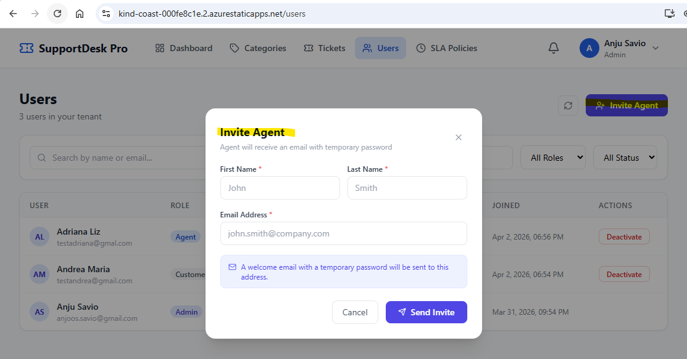

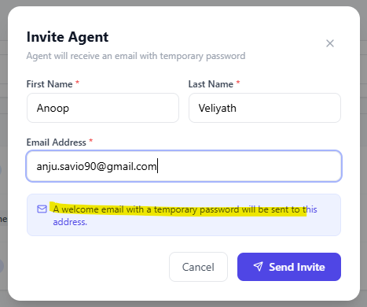

Request URL: https://supportdeskpro-api.victoriousdune-73ebad30.westus.azurecontainerapps.io/api/users/invite-agent

Request Method: POST

Request Payload:


Response:
```
{
    "success": true,
    "data": "25eb1d8a-2ee3-44c3-9015-c4640d7481c4",
    "message": "Agent invited successfully.",
    "errors": null,
    "pagination": null
}
```
#### **Mail sent from Invite agent**
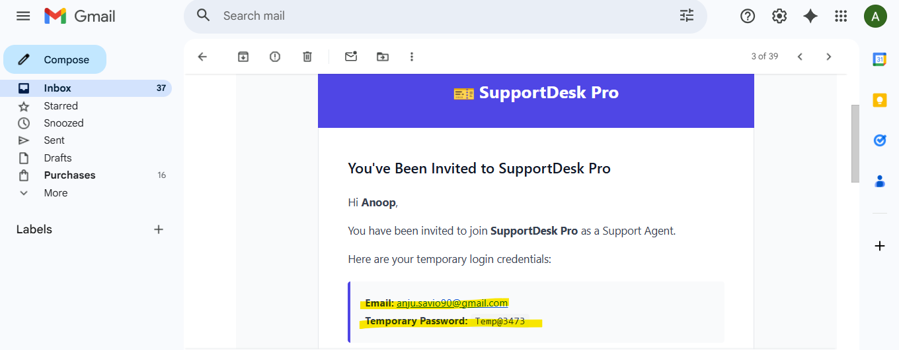

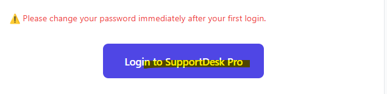

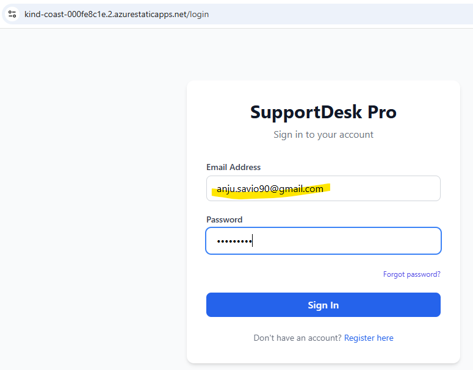

#### **Get Users**

Request URL: https://supportdeskpro-api.victoriousdune-73ebad30.westus.azurecontainerapps.io/api/users?page=1&pageSize=20

Request Method: GET

Response: 
```
{
    "success": true,
    "data": {
        "items": [
            {
                "id": "25eb1d8a-2ee3-44c3-9015-c4640d7481c4",
                "firstName": "Anoop",
                "lastName": "Veliyath",
                "email": "anju.savio90@gmail.com",
                "role": "Agent",
                "isActive": true,
                "isEmailVerified": true,
                "lastLoginAt": null,
                "createdAt": "2026-04-02T19:37:11.2910928"
            },
            {
                "id": "6c1083fa-8409-4a5a-b3a5-6f64d3ff1326",
                "firstName": "Adriana",
                "lastName": "Liz",
                "email": "testAdriana@gmail.com",
                "role": "Agent",
                "isActive": true,
                "isEmailVerified": true,
                "lastLoginAt": null,
                "createdAt": "2026-04-02T20:38:11.2910928"
            },
        ]
    }
}
```
### **SLA Policies**

#### **Create New SLA Policy**


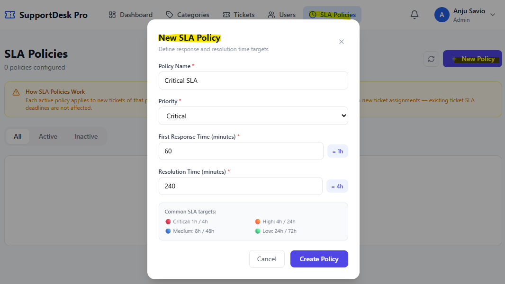

Request URL: https://supportdeskpro-api.victoriousdune-73ebad30.westus.azurecontainerapps.io/api/sla-policies

Request Method: POST

Request Payload:

```
{
    "name": "Critical SLA",
    "priority": 4,
    "firstResponseTimeMinutes": 60,
    "resolutionTimeMinutes": 240
}
```

#### **Get Policies**

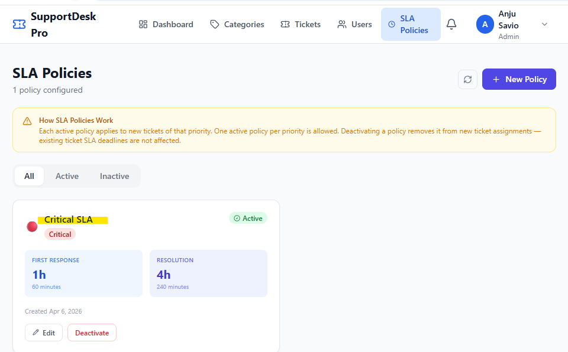

Request URL: https://supportdeskpro-api.victoriousdune-73ebad30.westus.azurecontainerapps.io/api/sla-policies?page=1&pageSize=20

Request Method: GET

Response:
```
{
    "success": true,
    "data": {
        "items": [
            {
                "id": "73b0359c-38d2-4278-88cb-6df8b3ad6834",
                "name": "Critical SLA",
                "priority": "Critical",
                "firstResponseTimeMinutes": 60,
                "resolutionTimeMinutes": 240,
                "isActive": true,
                "createdAt": "2026-04-06T18:03:13.6439569"
            }
        ],
        "totalCount": 1,
        "page": 1,
        "pageSize": 20
    },
    "message": null,
    "errors": null,
    "pagination": null
}
```

---

#### **Edit SLA Policy**

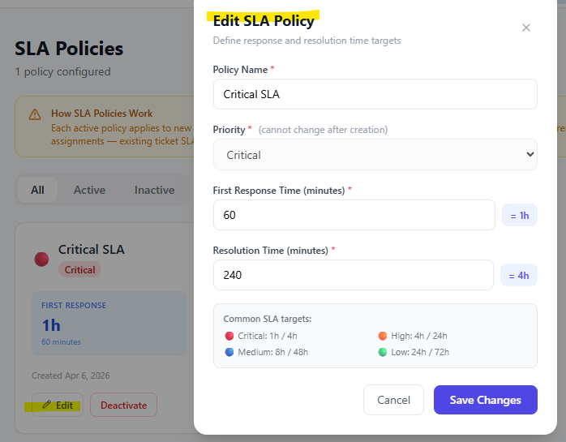

Request URL: https://supportdeskpro-api.victoriousdune-73ebad30.westus.azurecontainerapps.io/api/sla-policies/73b0359c-38d2-4278-88cb-6df8b3ad6834

Request Method: PUT

Request Payload:
```
{
    "name": "Critical SLA",
    "firstResponseTimeMinutes": 60,
    "resolutionTimeMinutes": 240
}
```

Response:
```
{
    "success": true,
    "data": "SLA policy updated successfully.",
    "message": null,
    "errors": null,
    "pagination": null
}
```

---

#### **Deactivate SLA Policy**

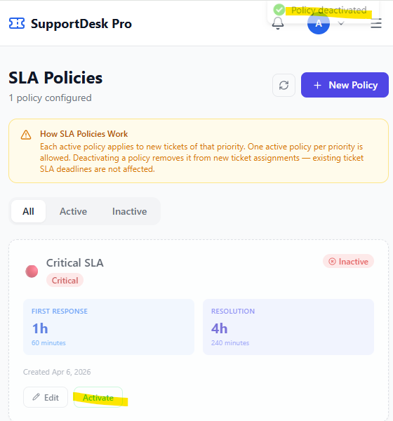

Request URL: https://supportdeskpro-api.victoriousdune-73ebad30.westus.azurecontainerapps.io/api/sla-policies/73b0359c-38d2-4278-88cb-6df8b3ad6834/status

Request Method: PATCH

Response:
```
{
    "success": true,
    "data": "SLA policy deactivated successfully.",
    "message": null,
    "errors": null,
    "pagination": null
}
```

---

#### **Get Active Policies**

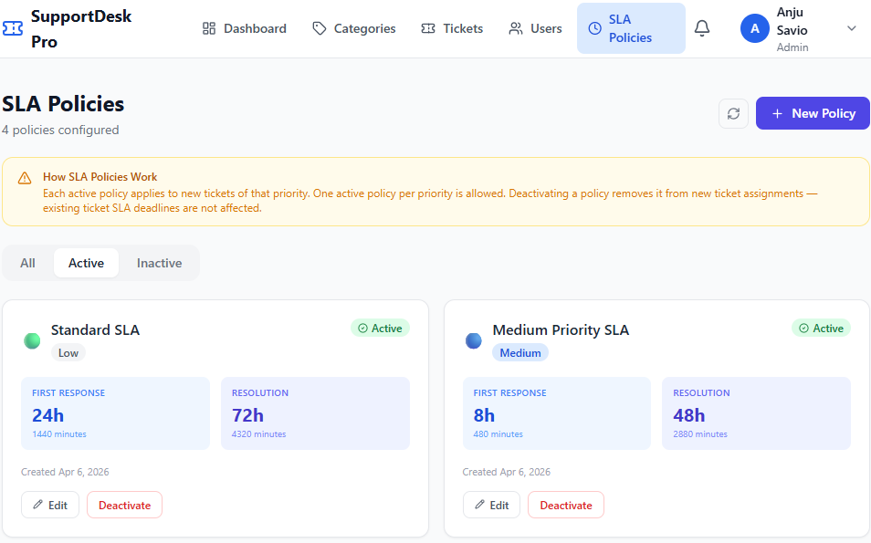

Request URL: https://supportdeskpro-api.victoriousdune-73ebad30.westus.azurecontainerapps.io/api/sla-policies?page=1&pageSize=20&isActive=true

Request Method: GET

Response:
```
{
    "success": true,
    "data": {
        "items": [
            {
                "id": "42e7d574-3fdb-48e1-80e3-b099b0290f18",
                "name": "Standard SLA",
                "priority": "Low",
                "firstResponseTimeMinutes": 1440,
                "resolutionTimeMinutes": 4320,
                "isActive": true,
                "createdAt": "2026-04-06T18:14:32.5229913"
            },
            {
                "id": "98ce2178-5b2c-4525-9a66-8043c497e0f2",
                "name": "Medium Priority SLA",
                "priority": "Medium",
                "firstResponseTimeMinutes": 480,
                "resolutionTimeMinutes": 2880,
                "isActive": true,
                "createdAt": "2026-04-06T18:13:57.0471562"
            }
        ]
    },
    "message": null,
    "errors": null,
    "pagination": null
}
```

---

#### **Get Inactive Policies**

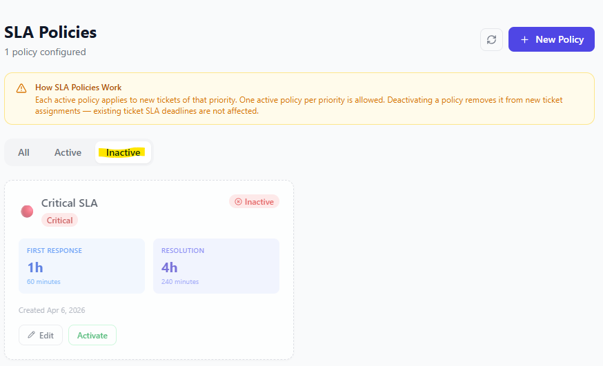

Request URL: https://supportdeskpro-api.victoriousdune-73ebad30.westus.azurecontainerapps.io/api/sla-policies?page=1&pageSize=20&isActive=false

Request Method: GET

Response:
```
{
    "success": true,
    "data": {
        "items": [
            {
                "id": "73b0359c-38d2-4278-88cb-6df8b3ad6834",
                "name": "Critical SLA",
                "priority": "Critical",
                "firstResponseTimeMinutes": 60,
                "resolutionTimeMinutes": 240,
                "isActive": false,
                "createdAt": "2026-04-06T18:03:13.6439569"
            }
        ],
        "totalCount": 1,
        "page": 1,
        "pageSize": 20
    },
    "message": null,
    "errors": null,
    "pagination": null
}
```
## Tickets

#### **Get Tickets**

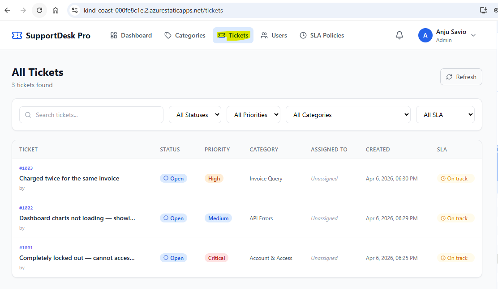

Request URL: https://supportdeskpro-api.victoriousdune-73ebad30.westus.azurecontainerapps.io/api/tickets?page=1&pageSize=20

Request Method: GET

Response:
```
{
    "success": true,
    "data": {
        "items": [
            {
                "id": "3358c32d-0c7d-4729-91f8-20fe987a8f87",
                "ticketNumber": 1003,
                "title": "Charged twice for the same invoice",
                "description": "I noticed two identical charges of $299 on my credit card statement",
                "status": "Open",
                "priority": "High",
                "categoryId": "88e88820-6863-4fae-bf72-cb2b5c819523",
                "categoryName": "Invoice Query",
                "customerId": "ca6a9df7-22bb-47ae-9880-6492d9320356",
                "customerName": "Andrea Maria",
                "assignedAgentId": null,
                "assignedAgentName": null,
                "slaFirstResponseDueAt": "2026-04-06T22:30:18.0342320"
            }
        ]
    },
    "message": null,
    "errors": null,
    "pagination": null
}
```

---

#### **Assign to Agent**

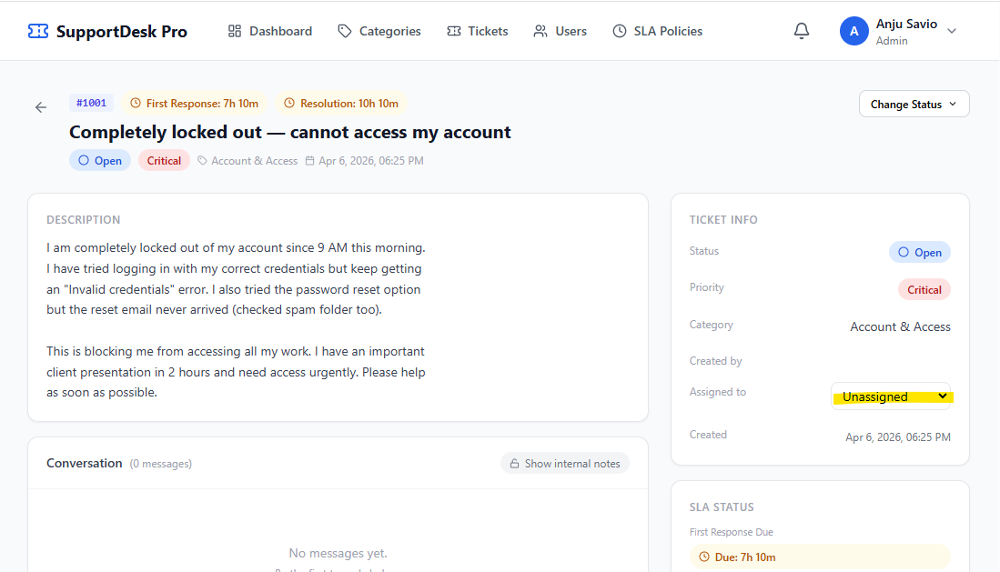

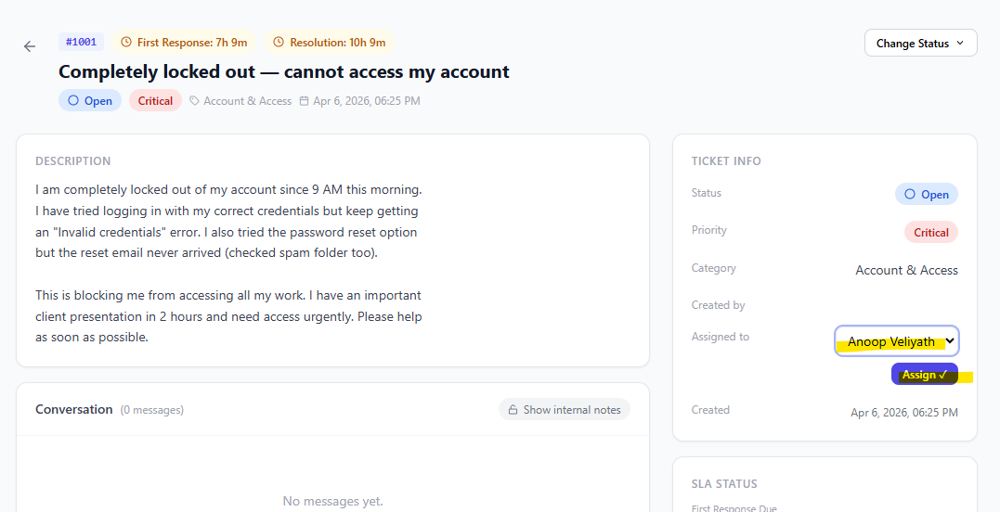

Request URL: https://supportdeskpro-api.victoriousdune-73ebad30.westus.azurecontainerapps.io/api/tickets/ad0ae6df-035a-49a5-b3f6-84f8ee100051/assign

Request Method: PATCH

Request Payload:
```
{
    "agentId": "2a9a8871-46ea-416e-b58e-18ffa9324e11"
}
```

Response:
```
{
    "success": true,
    "data": "Ticket assigned successfully.",
    "message": null,
    "errors": null,
    "pagination": null
}
```

---

#### **Send Comments**

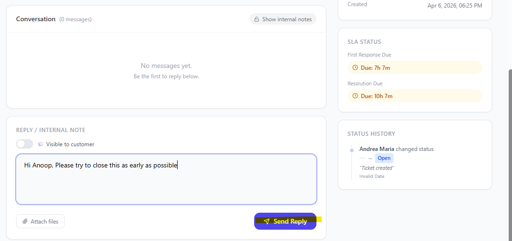

Request URL: https://supportdeskpro-api.victoriousdune-73ebad30.westus.azurecontainerapps.io/api/tickets/ad0ae6df-035a-49a5-b3f6-84f8ee100051/comments

Request Method: POST

Request Payload:
```
{
    "body": "Hi Anoop, Please try to close this as early as possible",
    "isInternal": false
}
```

---

#### **Get Comments**

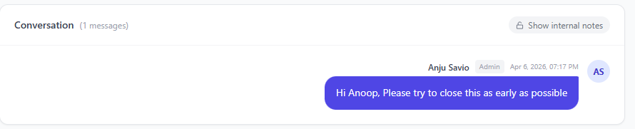

Request URL: https://supportdeskpro-api.victoriousdune-73ebad30.westus.azurecontainerapps.io/api/tickets/ad0ae6df-035a-49a5-b3f6-84f8ee100051/comments

Request Method: GET

Response:
```
{
    "success": true,
    "data": [
        {
            "id": "c2979271-460f-43e0-99e1-95a741224835",
            "ticketId": "ad0ae6df-035a-49a5-b3f6-84f8ee100051",
            "authorId": "28e8e138-584c-4457-8366-222c1a6e60e1",
            "authorName": "Anju Savio",
            "authorRole": "Admin",
            "body": "Hi Anoop, Please try to close this as early as possible",
            "isInternal": false,
            "isEdited": false,
            "editedAt": null,
            "sentimentScore": null,
            "sentimentLabel": null,
            "createdAt": "2026-04-06T19:17:49.0011955"
        }
    ],
    "message": null,
    "errors": null,
    "pagination": null
}
```

---

## Dashboard

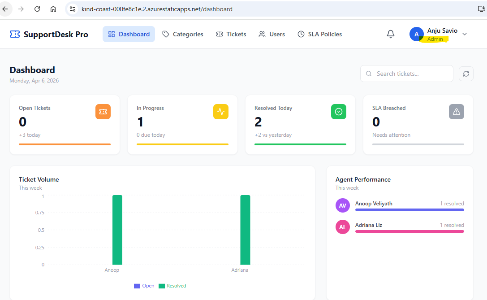

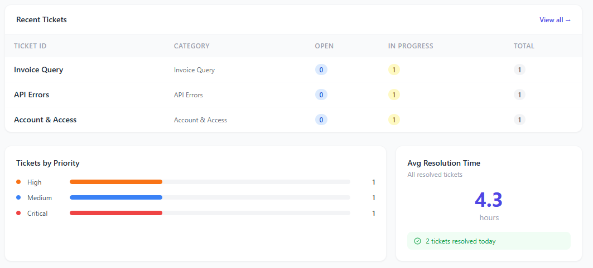

Request URL: https://supportdeskpro-api.victoriousdune-73ebad30.westus.azurecontainerapps.io/api/dashboard/admin

Request Method: GET

Response:
```
{
    "success": true,
    "data": {
        "totalTickets": 3,
        "openTickets": 0,
        "inProgressTickets": 1,
        "resolvedTickets": 1,
        "closedTickets": 1,
        "ticketsCreatedToday": 3,
        "ticketsResolvedToday": 2,
        "slaBreachedCount": 0,
        "slaBreachedToday": 0,
        "averageResolutionTimeHours": 4.3,
        "ticketsByCategory": [
            {
                "categoryName": "Invoice Query",
                "openCount": 0,
                "totalCount": 1
            },
            {
                "categoryName": "API Errors",
                "openCount": 0,
                "totalCount": 1
            }
        ],
        "ticketsByAgent": [
            {
                "agentName": "Anoop Veliyath",
                "openCount": 0,
                "inProgressCount": 1,
                "resolvedTodayCount": 1
            },
            {
                "agentName": "Adriana Liz",
                "openCount": 0,
                "inProgressCount": 0,
                "resolvedTodayCount": 1
            }
        ],
        "ticketsByPriority": [
            {
                "priority": "High",
                "count": 1
            },
            {
                "priority": "Medium",
                "count": 1
            }
        ]
    },
    "message": null,
    "errors": null,
    "pagination": null
}
```

# Customer

#### **User Registration**

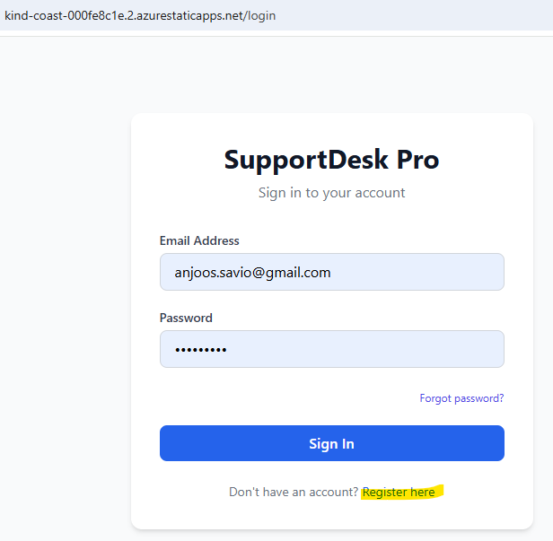

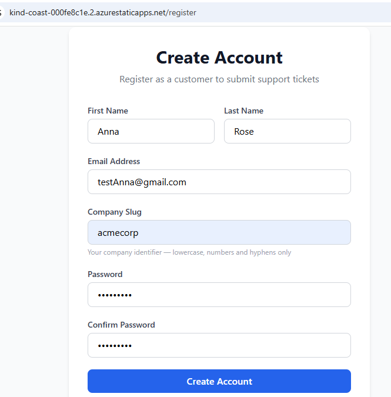

Request URL: https://supportdeskpro-api.victoriousdune-73ebad30.westus.azurecontainerapps.io/api/auth/register

Request Method: POST

Request Payload:
```
{
    "firstName": "Anna",
    "lastName": "Rose",
    "email": "testAnna@gmail.com",
    "password": "Anna@1234",
    "confirmPassword": "Anna@1234",
    "tenantSlug": "acmecorp"
}
```

Response:
```
{
    "success": true,
    "data": "Registration successful! Please check your email.",
    "message": null,
    "errors": null,
    "pagination": null
}
```

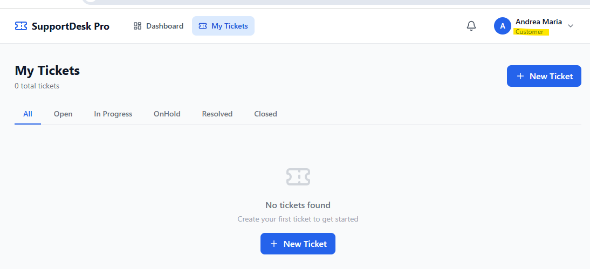

---

#### **Create New Ticket**

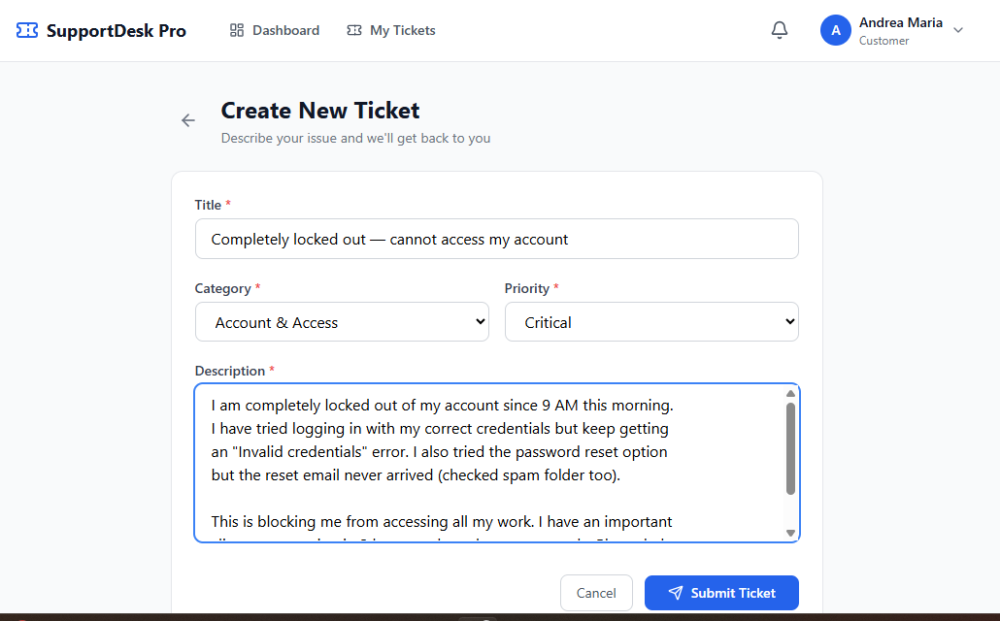

Request URL: https://supportdeskpro-api.victoriousdune-73ebad30.westus.azurecontainerapps.io/api/tickets

Request Method: POST

Request Payload:
```
{
    "title": "Completely locked out - cannot access my account",
    "description": "I am completely locked out of my account since 9 AM this morning. I have tried",
    "categoryId": "c5e66bd3-b2d7-4977-a06c-29f3c79f25fd",
    "priority": 4
}
```

Response:
```
{
    "success": true,
    "data": "ad0ae6df-035a-49a5-b3f6-84f8ee100051",
    "message": "Ticket #1001 created successfully.",
    "errors": null,
    "pagination": null
}
```

---

#### **AI - Suggestion for Category and Priority**

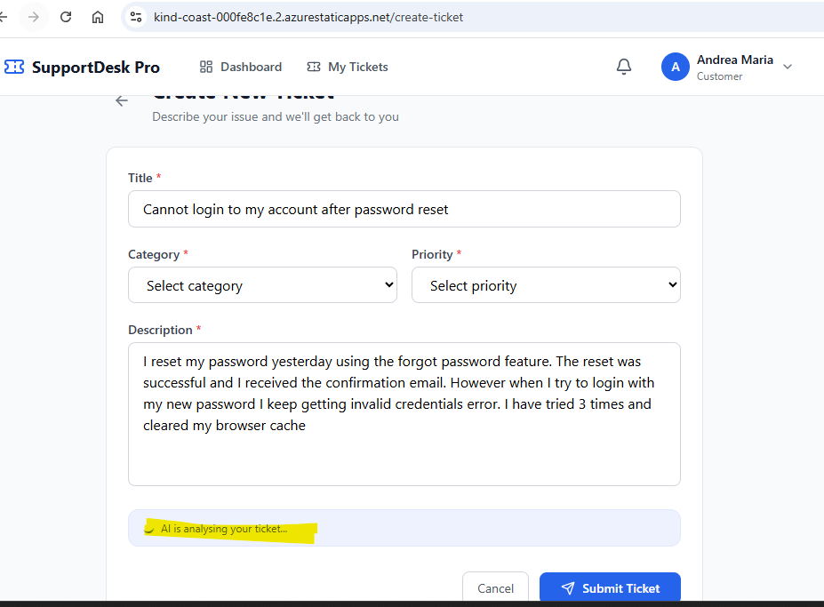

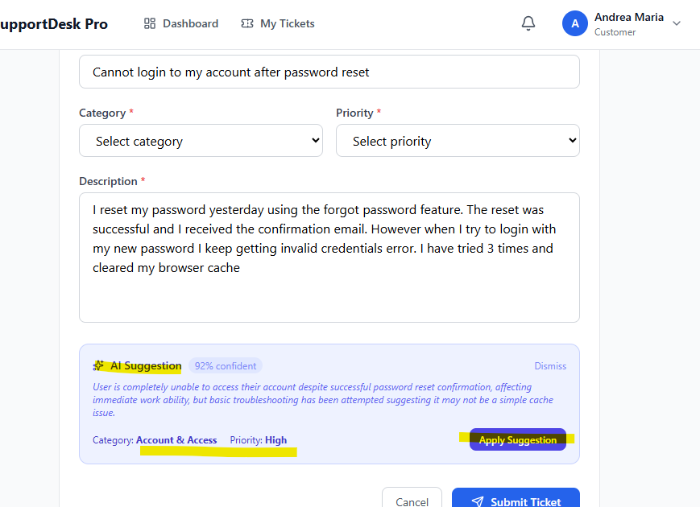

Request URL: https://supportdeskpro-api.victoriousdune-73ebad30.westus.azurecontainerapps.io/api/tickets/ai-suggest

Request Method: POST

Request Payload:
```
{
    "title": "Cannot login to my account after password reset",
    "description": "I reset my password yesterday using the forgot password feature. The reset was successful and I received the confirmation email. However when I try to login with my new password I keep getting invalid credentials error. I have tried 3 times and cleared my browser cache"
}
```

Response:
```
{
    "success": true,
    "data": {
        "suggestedCategory": "Account & Access",
        "suggestedPriority": "High",
        "confidence": 0.92,
        "reasoning": "User is completely unable to access their account despite successful password reset confirmation, affecting immediate work ability, but basic troubleshooting has been attempted suggesting it may not be a simple cache issue."
    },
    "message": null,
    "errors": null,
    "pagination": null
}
```

**Apply Suggestion** — binding category and priority

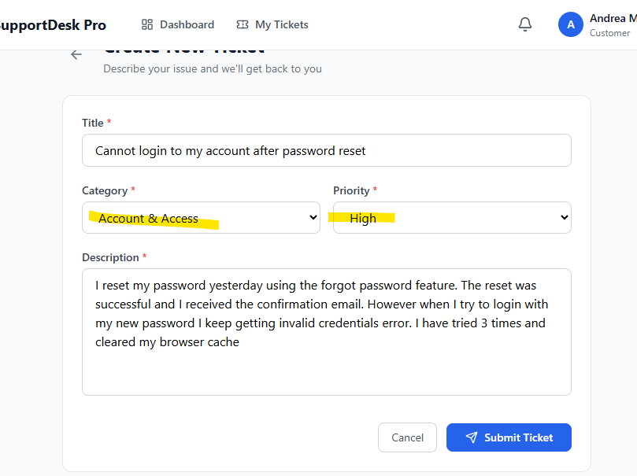

---

#### **Get My Tickets**

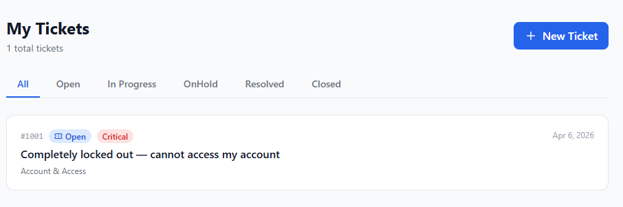

Request URL: https://supportdeskpro-api.victoriousdune-73ebad30.westus.azurecontainerapps.io/api/tickets/my?page=1&pageSize=10

Request Method: GET

Response:
```
{
    "success": true,
    "data": {
        "items": [
            {
                "id": "ad0ae6df-035a-49a5-b3f6-84f8ee100051",
                "ticketNumber": 1001,
                "title": "Completely locked out - cannot access my account",
                "description": "I am completely locked out of my account since 9 AM this morning.",
                "status": "Open",
                "priority": "Critical",
                "categoryId": "c5e66bd3-b2d7-4977-a06c-29f3c79f25fd",
                "categoryName": "Account & Access",
                "customerId": "ca6a9df7-22bb-47ae-9880-6492d9320356",
                "customerName": "Andrea Maria",
                "assignedAgentId": null,
                "assignedAgentName": null,
                "slaFirstResponseDueAt": "2026-04-06T19:25:06.16441",
                "slaResolutionDueAt": "2026-04-06T22:25:06.16441",
                "firstResponseAt": null,
                "resolvedAt": null,
                "isSLABreached": false
            }
        ]
    },
    "message": null,
    "errors": null,
    "pagination": null
}
```

---

#### **My Tickets — Status Filtration**

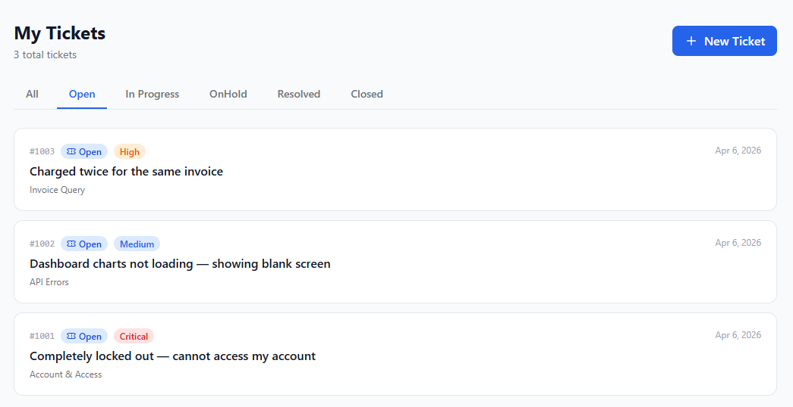

Request URL: https://supportdeskpro-api.victoriousdune-73ebad30.westus.azurecontainerapps.io/api/tickets/my?page=1&pageSize=10&status=1

Request Method: GET

Response:
```
{
    "success": true,
    "data": {
        "items": [
            {
                "id": "3358c32d-0c7d-4729-91f8-20fe987a8f87",
                "ticketNumber": 1003,
                "title": "Charged twice for the same invoice",
                "description": "I noticed two identical charges of $299 on my credit card statement.",
                "status": "Open",
                "priority": "High",
                "categoryId": "88e88820-6863-4fae-bf72-cb2b5c819523",
                "categoryName": "Invoice Query",
                "customerId": "ca6a9df7-22bb-47ae-9880-6492d9320356",
                "customerName": "Andrea Maria",
                "assignedAgentId": null,
                "assignedAgentName": null,
                "slaFirstResponseDueAt": "2026-04-06T22:30:18.9342329",
                "slaResolutionDueAt": "2026-04-07T18:30:18.9342329",
                "firstResponseAt": null,
                "resolvedAt": null,
                "isSLABreached": false
            }
        ]
    },
    "message": null,
    "errors": null,
    "pagination": null
}
```

---

#### **History**

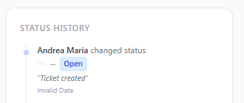

Request URL: https://supportdeskpro-api.victoriousdune-73ebad30.westus.azurecontainerapps.io/api/tickets/3358c32d-0c7d-4729-91f8-20fe987a8f87/history

Request Method: GET

Response:
```
{
    "success": true,
    "data": [
        {
            "id": "62f866ff-5754-4c1e-a998-efbab0b816ca",
            "fromStatus": null,
            "toStatus": "Open",
            "changedByName": "Andrea Maria",
            "note": "Ticket created",
            "createdAt": "2026-04-06T18:30:18.9345407"
        }
    ],
    "message": null,
    "errors": null,
    "pagination": null
}
```

---

#### **Conversation**

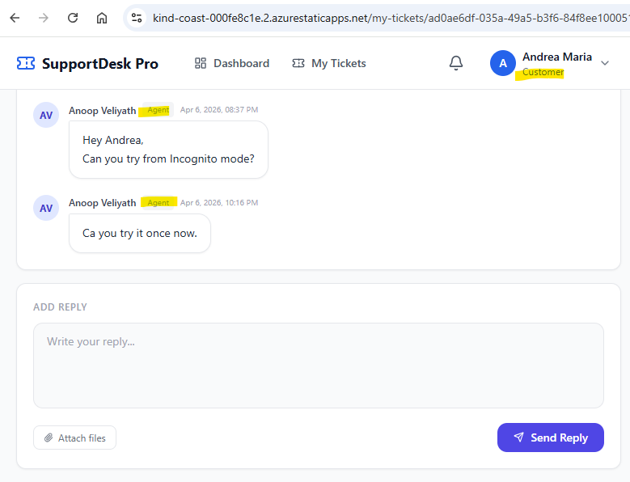

Request URL: https://supportdeskpro-api.victoriousdune-73ebad30.westus.azurecontainerapps.io/api/tickets/ad0ae6df-035a-49a5-b3f6-84f8ee100051/comments

Request Method: GET

Response:
```
{
    "success": true,
    "data": [
        {
            "id": "c2979271-460f-43e0-99e1-95a741224835",
            "ticketId": "ad0ae6df-035a-49a5-b3f6-84f8ee100051",
            "authorId": "28e8e138-584c-4457-8366-222c1a6e60e1",
            "authorName": "Anju Savio",
            "authorRole": "Admin",
            "body": "Hi Anoop, Please try to close this as early as possible",
            "isInternal": false,
            "isEdited": false,
            "editedAt": null,
            "sentimentScore": null,
            "sentimentLabel": null,
            "createdAt": "2026-04-06T19:17:49.0011955"
        },
        {
            "id": "15bd8cb9-21b3-4ca8-9e9b-20512fd4fa5d",
            "ticketId": "ad0ae6df-035a-49a5-b3f6-84f8ee100051",
            "authorId": "2a9a8871-46ea-416e-b58e-18ffa9324e11",
            "authorName": "Anoop Veliyath",
            "authorRole": "Agent"
            "body": "Hello, sure, working on it",
            "isInternal": false,
            "isEdited": false,
            "editedAt": null,
            "sentimentScore": null,
            "sentimentLabel": null,
            "createdAt": "2026-04-06T19:17:49.0011955"
        }
    ],
    "message": null,
    "errors": null,
    "pagination": null
}
```

---

#### **Send Reply**

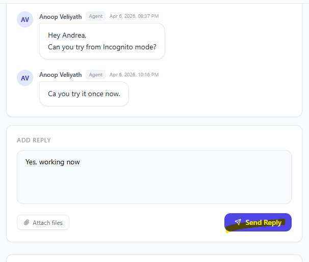

Request URL: https://supportdeskpro-api.victoriousdune-73ebad30.westus.azurecontainerapps.io/api/tickets/ad0ae6df-035a-49a5-b3f6-84f8ee100051/comments

Request Method: POST

Request Payload:
```
{
    "body": "Yes, working now",
    "isInternal": false
}
```

Response:
```
{
    "success": true,
    "data": "5d27f3bb-2734-4ebd-9862-cfdc71fb9137",
    "message": "Comment posted successfully.",
    "errors": null,
    "pagination": null
}
```


#### **Get Comments**

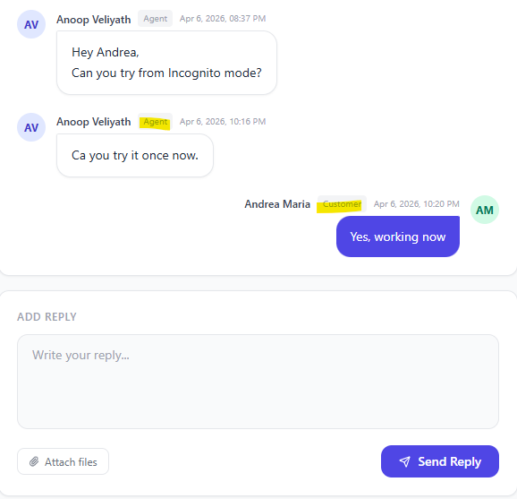

Request URL: https://supportdeskpro-api.victoriousdune-73ebad30.westus.azurecontainerapps.io/api/tickets/ad0ae6df-035a-49a5-b3f6-84f8ee100051/comments

Request Method: POST

Request Payload:
```
{
    "body": "Yes, working now",
    "isInternal": false
}
```

Response:
```
{
    "success": true,
    "data": "5d27f3bb-2734-4ebd-9862-cfdc71fb9137",
    "message": "Comment posted successfully.",
    "errors": null,
    "pagination": null
}
```

---

# Agent

#### **Dashboard**

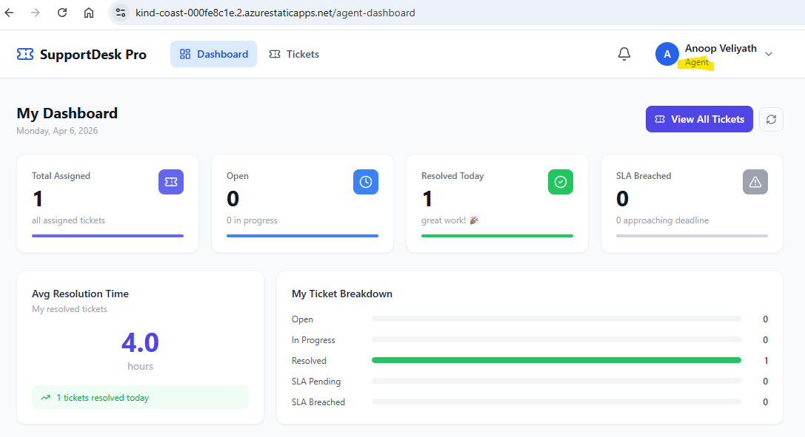

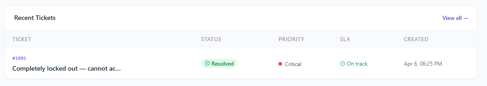

Request URL: https://supportdeskpro-api.victoriousdune-73ebad30.westus.azurecontainerapps.io/api/dashboard/agent

Request Method: GET

Response:
```
{
    "success": true,
    "data": {
        "myTotalAssigned": 1,
        "myOpenTickets": 0,
        "myInProgressTickets": 0,
        "myResolvedToday": 1,
        "mySLABreachedCount": 0,
        "mySLAPendingCount": 0,
        "myAverageResolutionTimeHours": 4,
        "myRecentTickets": [
            {
                "id": "ad0ae6df-035a-49a5-b3f6-84f8ee100051",
                "ticketNumber": 1001,
                "title": "Completely locked out - cannot access my account",
                "status": "Resolved",
                "priority": "Critical",
                "isSLABreached": false,
                "createdAt": "2026-04-06T18:25:06.349516"
            }
        ]
    },
    "message": null,
    "errors": null,
    "pagination": null
}
```

---

#### **My Queue**

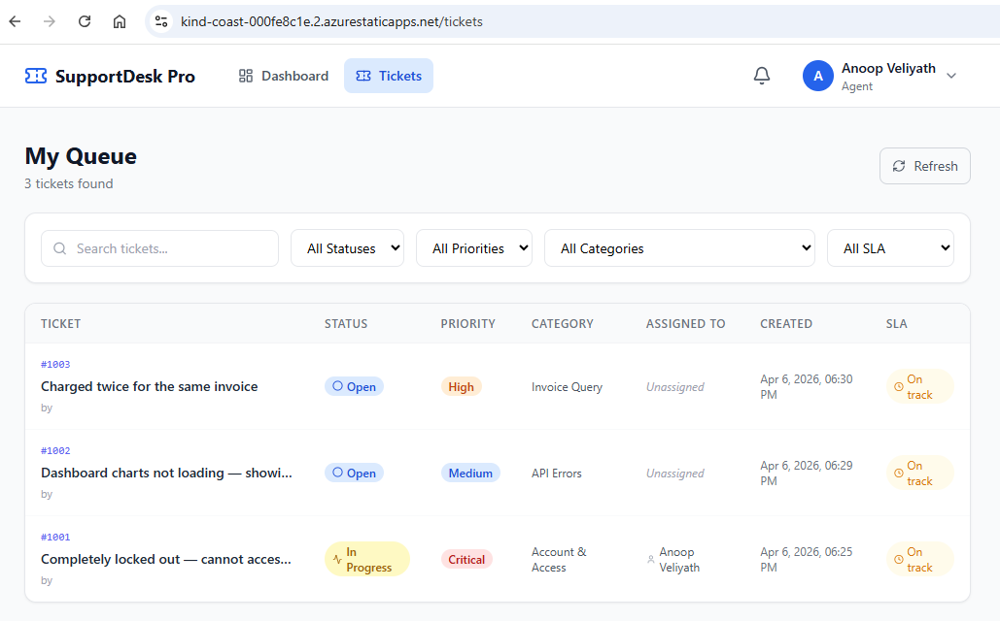

Request URL: https://supportdeskpro-api.victoriousdune-73ebad30.westus.azurecontainerapps.io/api/tickets?page=1&pageSize=20

Request Method: GET

Response:
```
{
    "success": true,
    "data": {
        "items": [
            {
                "id": "3358c32d-0c7d-4729-91f8-20fe987a8f87",
                "ticketNumber": 1003,
                "title": "Charged twice for the same invoice",
                "description": "I noticed two identical charges of $299 on",
                "status": "Open",
                "priority": "High",
                "categoryId": "88e88820-6863-4fae-bf72-cb2b5c819523",
                "categoryName": "Invoice Query",
                "customerId": "ca6a9df7-22bb-47ae-9880-6492d9320356",
                "customerName": "Andrea Maria",
                "assignedAgentId": null,
                "assignedAgentName": null,
                "slaFirstResponseDueAt": "2026-04-06T22:30:18.9342329",
                "slaResolutionDueAt": "2026-04-07T18:30:18.9342329",
                "firstResponseAt": null,
                "resolvedAt": null,
                "isSLABreached": false
            }
        ]
    },
    "message": null,
    "errors": null,
    "pagination": null
}
```

---

#### **View Ticket Details**

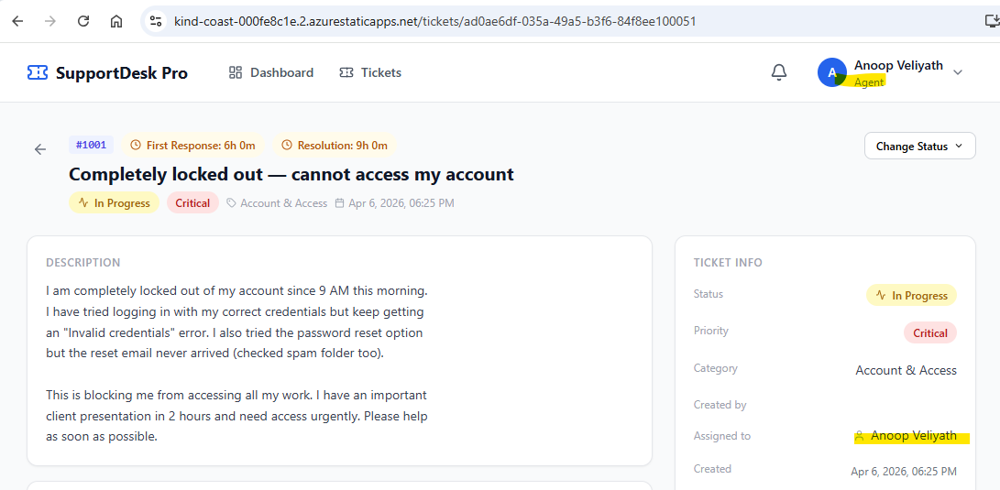

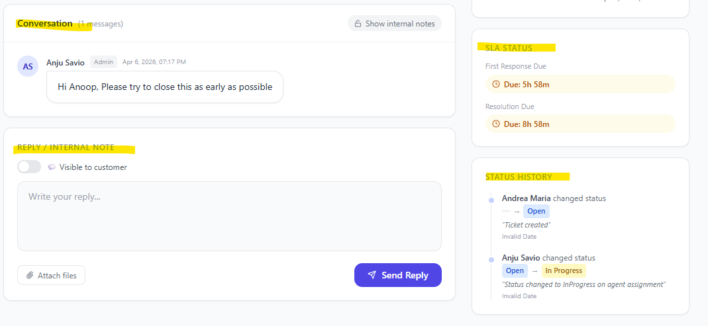

Request URL: https://supportdeskpro-api.victoriousdune-73ebad30.westus.azurecontainerapps.io/api/tickets/ad0ae6df-035a-49a5-b3f6-84f8ee100051

Request Method: GET

Response:
```
{
    "success": true,
    "data": {
        "id": "ad0ae6df-035a-49a5-b3f6-84f8ee100051",
        "ticketNumber": 1001,
        "title": "Completely locked out - cannot access my account",
        "description": "I am completely locked out of my account since 9 AM this morning. \nI have tried logging in with my correct credentials but keep getting \nan \"Invalid credentials\" error. I also tried the password reset option \nbut the reset email never arrived (checked spam folder too).\n\nThis is blocking me from accessing all my work. I have an important \nclient presentation in 2 hours and need access urgently. Please help \nas soon as possible.",
        "status": "InProgress",
        "priority": "Critical",
        "categoryId": "c5e66bd3-b2d7-4977-a06c-29f3c79f25fd",
        "categoryName": "Account & Access",
        "customerId": "ca6a9df7-22bb-47ae-9880-6492d9320356",
        "customerName": "Andrea Maria",
        "customerEmail": "testandrea@gmail.com",
        "assignedAgentId": "2a9a8871-46ea-416e-b58e-18ffa9324e11",
        "assignedAgentName": "Anoop Veliyath",
        "assignedAgentEmail": "anju.savio90@gmail.com",
        "slaFirstResponseDueAt": "2026-04-06T19:25:06.16441",
        "slaResolutionDueAt": "2026-04-06T22:25:06.16441",
        "firstResponseAt": "2026-04-06T19:17:48.928761",
        "resolvedAt": null,
        "closedAt": null,
        "isSLABreached": false,
        "slaBreachedAt": null,
        "aiSuggestedCategoryName": null,
        "aiSuggestedPriority": null,
        "aiCategorizationConfidence": null,
        "lastActivityAt": "2026-04-06T19:17:48.928761",
        "createdAt": "2026-04-06T18:25:06.349516"
    },
    "message": null,
    "errors": null,
    "pagination": null
}
```

---

#### **Conversation**

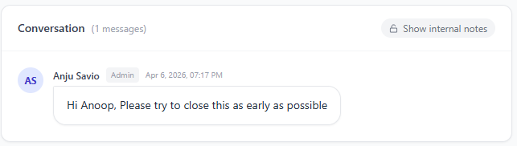

Request URL: https://supportdeskpro-api.victoriousdune-73ebad30.westus.azurecontainerapps.io/api/tickets/ad0ae6df-035a-49a5-b3f6-84f8ee100051/comments

Request Method: GET

Response:
```
{
    "success": true,
    "data": [
        {
            "id": "c2979271-460f-43e0-99e1-95a741224835",
            "ticketId": "ad0ae6df-035a-49a5-b3f6-84f8ee100051",
            "authorId": "28e8e138-584c-4457-8366-222c1a6e60e1",
            "authorName": "Anju Savio",
            "authorRole": "Admin",
            "body": "Hi Anoop, Please try to close this as early as possible",
            "isInternal": false,
            "isEdited": false,
            "editedAt": null,
            "sentimentScore": null,
            "sentimentLabel": null,
            "createdAt": "2026-04-06T19:17:49.0011955"
        }
    ],
    "message": null,
    "errors": null,
    "pagination": null
}
```

---

#### **Reply / Internal Note**

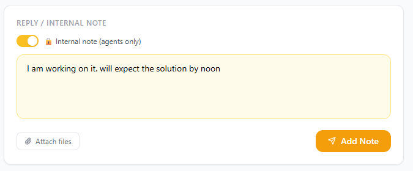

Request URL: https://supportdeskpro-api.victoriousdune-73ebad30.westus.azurecontainerapps.io/api/tickets/ad0ae6df-035a-49a5-b3f6-84f8ee100051/comments

Request Method: POST

Request Payload:
```
{
    "body": "I am working on it. will expect the solution by noon",
    "isInternal": true
}
```

Response:
```
{
    "success": true,
    "data": "33665b18-93aa-4e82-8445-4d84a85d2815",
    "message": "Comment posted successfully.",
    "errors": null,
    "pagination": null
}
```

---

#### **Show / Hide Internal Note**

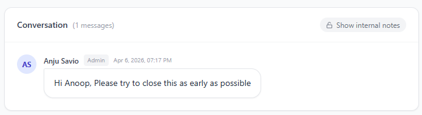

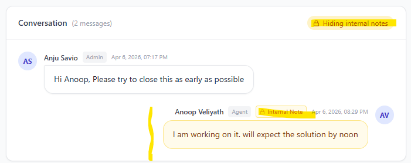

---

#### **AI-Powered Reply Drafting for Agents / Admin**

##### Note - Visible to Customer

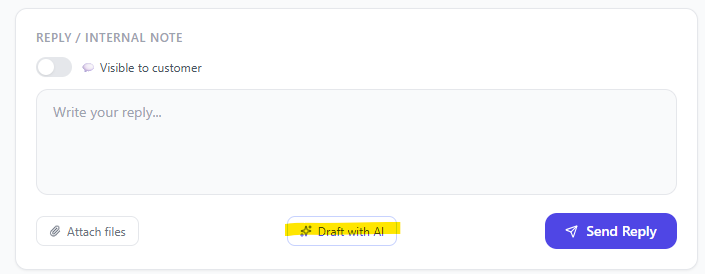

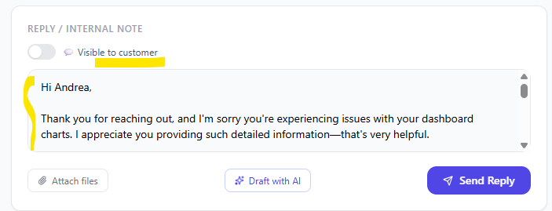

Request URL: https://supportdeskpro-api.victoriousdune-73ebad30.westus.azurecontainerapps.io/api/tickets/8921cd98-e63a-4b86-b332-7db38cd3ab87/ai-draft-reply

Request Method: POST

Request Payload:
```
{
    "isInternal": false
}
```

Response:
```
{
    "success": true,
    "data": {
        "draftReply": "Hi Andrea,\n\nThank you for reaching out, and I'm sorry you're experiencing issues with..."
    },
    "message": null,
    "errors": null,
    "pagination": null
}
```

##### Note - Admin to Agent / Agent to Admin (Invisible to Customer)

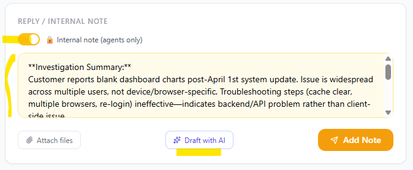

---

#### **AI: RAG-Inspired Similar Ticket Search with AI Resolution Extraction**

##### Similar Past Tickets (Only for Agent / Admin)

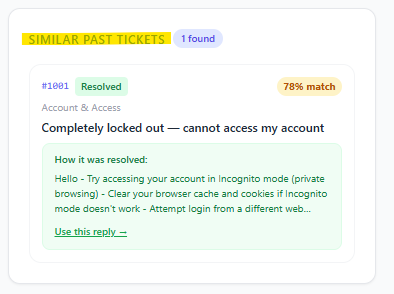

Request URL: https://supportdeskpro-api.victoriousdune-73ebad30.westus.azurecontainerapps.io/api/tickets/5a97c4bf-53c6-47dc-8c2d-c8171d397614/similar

Request Method: GET

Response:
```
{
    "success": true,
    "data": [
        {
            "id": "ad0ae6df-035a-49a5-b3f6-84f8ee100051",
            "ticketNumber": 1001,
            "title": "Completely locked out - cannot access my account",
            "categoryName": "Account & Access",
            "status": "Resolved",
            "resolution": "- Try accessing your account in Incognito mode (private browsing)\n- Clear your browser cache and cookies if Incognito",
            "similarityScore": 0.78,
            "resolvedAt": "2026-04-06T22:25:25.2070075"
        }
    ],
    "message": null,
    "errors": null,
    "pagination": null
}
```

##### Use This Reply

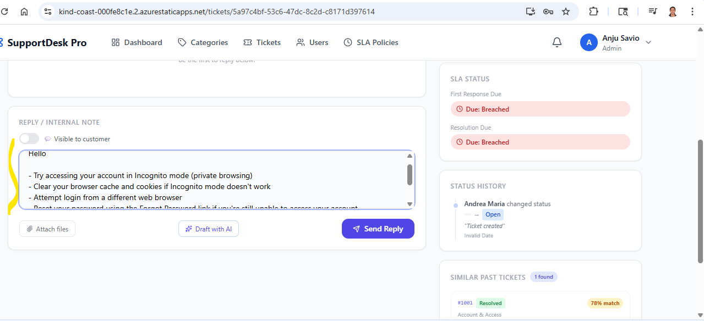

---

#### **AI Sentiment Detection — Warns Agents if the Customer Seems Frustrated**

##### 🔴 Red — Frustrated

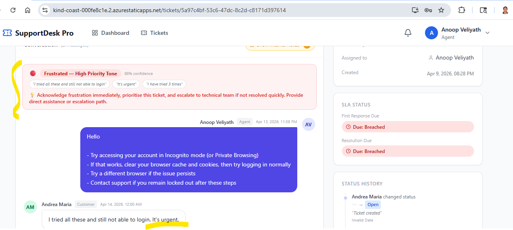

##### 🟢 Neutral — Green Color Representation

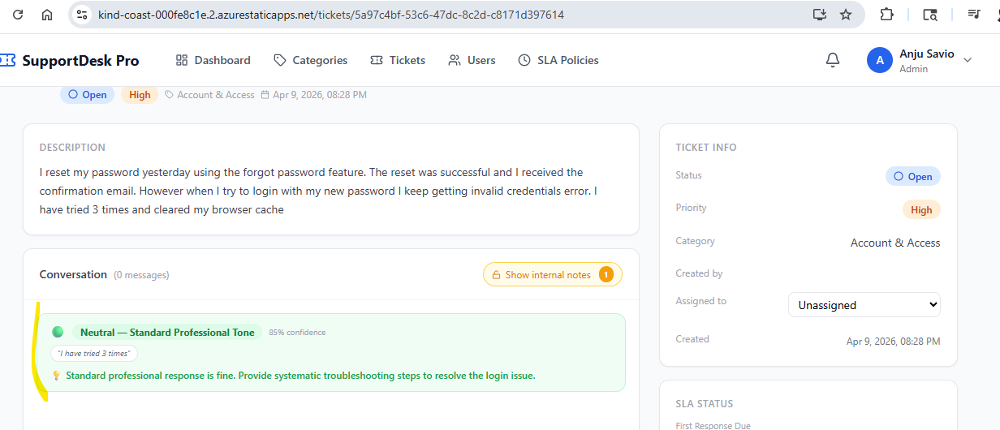

Request URL: https://supportdeskpro-api.victoriousdune-73ebad30.westus.azurecontainerapps.io/api/tickets/5a97c4bf-53c6-47dc-8c2d-c8171d397614/sentiment

Request Method: GET

Response:
```
{
    "success": true,
    "data": {
        "level": "Neutral",
        "label": "Neutral - Standard Priority Tone",
        "confidence": 0.85,
        "triggerPhrases": [
            "I have tried 3 times"
        ],
        "agentAdvice": "Standard professional response is appropriate. Provide clear troubleshooting steps and technical investigation of the login issue."
    },
    "message": null,
    "errors": null,
    "pagination": null
}
```

---

#### **Get Comments from Customer**

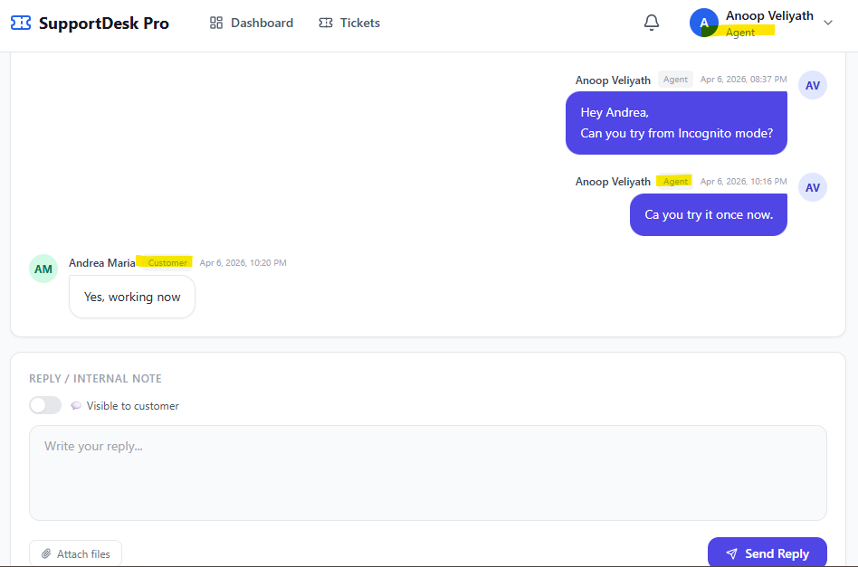

Request URL: https://supportdeskpro-api.victoriousdune-73ebad30.westus.azurecontainerapps.io/api/tickets/ad0ae6df-035a-49a5-b3f6-84f8ee100051/comments

Request Method: GET

Response:
```
{
    "success": true,
    "data": [
        {
            "id": "c2979271-460f-43e0-99e1-95a741224835",
            "ticketId": "ad0ae6df-035a-49a5-b3f6-84f8ee100051",
            "authorId": "28e8e138-584c-4457-8366-222c1a6e60e1",
            "authorName": "Anju Savio",
            "authorRole": "Admin",
            "body": "Hi Anoop, Please try to close this as early as possible",
            "isInternal": false,
            "isEdited": false,
            "editedAt": null,
            "sentimentScore": null,
            "sentimentLabel": null,
            "createdAt": "2026-04-06T19:17:49.0011955"
        },
        {
            "id": "33665b18-93aa-4e82-8445-4d84a85d2815",
            "ticketId": "ad0ae6df-035a-49a5-b3f6-84f8ee100051"
        }
    ],
    "message": null,
    "errors": null,
    "pagination": null
}
```

---

#### **Change Status to OnHold / Resolved / Closed**

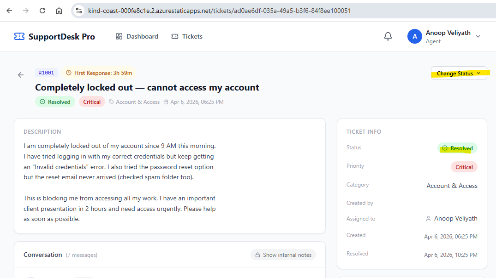

Request URL: https://supportdeskpro-api.victoriousdune-73ebad30.westus.azurecontainerapps.io/api/tickets/ad0ae6df-035a-49a5-b3f6-84f8ee100051/status

Request Method: PATCH

Request Payload:
```
{
    "status": 4
}
```

---

#### **Filter Status — Open / InProgress / OnHold / Resolved / Closed**

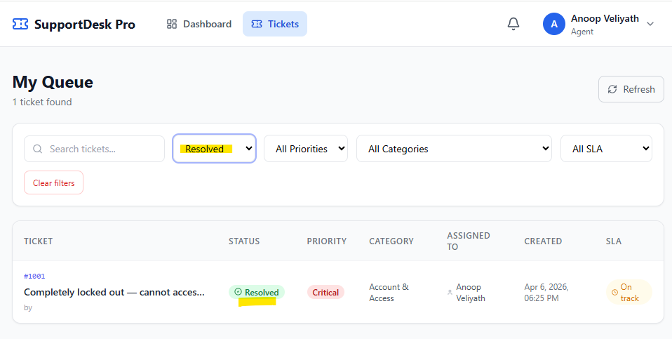

Request URL: https://supportdeskpro-api.victoriousdune-73ebad30.westus.azurecontainerapps.io/api/tickets?page=1&pageSize=20&status=4

Request Method: GET

Response:
```
{
    "success": true,
    "data": {
        "items": [
            {
                "id": "ad0ae6df-035a-49a5-b3f6-84f8ee100051",
                "ticketNumber": 1001,
                "title": "Completely locked out - cannot access my account",
                "description": "I am completely locked out of my account since",
                "status": "Resolved",
                "priority": "Critical",
                "categoryId": "c5e66bd3-b2d7-4977-a06c-29f3c79f25fd",
                "categoryName": "Account & Access",
                "customerId": "ca6a9df7-22bb-47ae-9880-6492d9320356",
                "customerName": "Andrea Maria",
                "assignedAgentId": "2a9a8871-46ea-416e-b58e-18ffa9324e11",
                "assignedAgentName": "Anoop Veliyath",
                "slaFirstResponseDueAt": "2026-04-06T19:25:06.16441",
                "slaResolutionDueAt": "2026-04-06T22:25:06.16441",
                "firstResponseAt": "2026-04-06T19:17:48.928761",
                "resolvedAt": "2026-04-06T22:25:25.2070075",
                "isSLABreached": false
            }
        ]
    },
    "message": null,
    "errors": null,
    "pagination": null
}
```

---

#### **Filter Priority — Low / Medium / High / Critical**

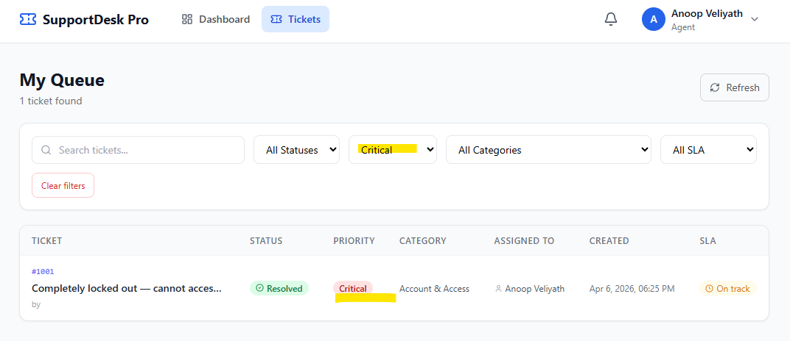

Request URL: https://supportdeskpro-api.victoriousdune-73ebad30.westus.azurecontainerapps.io/api/tickets?page=1&pageSize=20&priority=4

Request Method: GET

Response:
```
{
    "success": true,
    "data": {
        "items": [
            {
                "id": "ad0ae6df-035a-49a5-b3f6-84f8ee100051",
                "ticketNumber": 1001,
                "title": "Completely locked out - cannot access my account",
                "description": "I am completely locked out of my account since 9 AM this morning.",
                "status": "Resolved",
                "priority": "Critical",
                "categoryId": "c5e66bd3-b2d7-4977-a06c-29f3c79f25fd",
                "categoryName": "Account & Access",
                "customerId": "ca6a9df7-22bb-47ae-9880-6492d9320356",
                "customerName": "Andrea Maria",
                "assignedAgentId": "2a9a8871-46ea-416e-b58e-18ffa9324e11",
                "assignedAgentName": "Anoop Veliyath",
                "slaFirstResponseDueAt": "2026-04-06T19:25:06.16441",
                "slaResolutionDueAt": "2026-04-06T22:25:06.16441",
                "firstResponseAt": "2026-04-06T19:17:48.928761",
                "resolvedAt": "2026-04-06T22:25:25.2070075",
                "isSLABreached": false
            }
        ]
    },
    "message": null,
    "errors": null,
    "pagination": null
}
```

---

#### **Filter Category Wise**

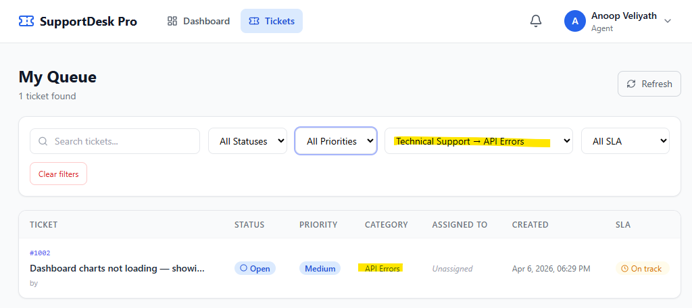

Request URL: https://supportdeskpro-api.victoriousdune-73ebad30.westus.azurecontainerapps.io/api/tickets?page=1&pageSize=20&categoryId=f037824c-82d6-4fc1-8949-849f0cb70a30

Request Method: GET

Response:
```
{
    "success": true,
    "data": {
        "items": [
            {
                "id": "8921cd98-e63a-4b86-b332-7db38cd3ab87",
                "ticketNumber": 1002,
                "title": "Dashboard charts not loading - showing blank screen",
                "description": "The charts on my dashboard stopped loading yesterday aft",
                "status": "Open",
                "priority": "Medium",
                "categoryId": "f037824c-82d6-4fc1-8949-849f0cb70a30",
                "categoryName": "API Errors",
                "customerId": "ca6a9df7-22bb-47ae-9880-6492d9320356",
                "customerName": "Andrea Maria",
                "assignedAgentId": null,
                "assignedAgentName": null,
                "slaFirstResponseDueAt": "2026-04-07T02:29:25.4460911",
                "slaResolutionDueAt": "2026-04-08T18:29:25.4460911",
                "firstResponseAt": null,
                "resolvedAt": null,
                "isSLABreached": false
            }
        ]
    },
    "message": null,
    "errors": null,
    "pagination": null
}
```

---

#### **Filter SLA**

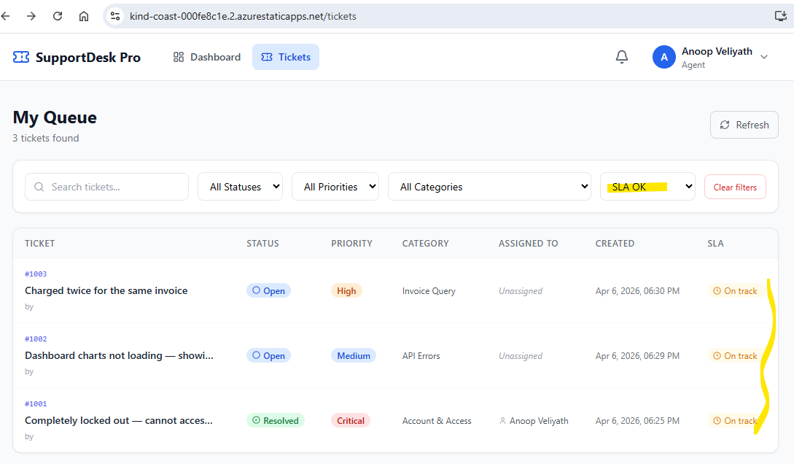

Request URL: https://supportdeskpro-api.victoriousdune-73ebad30.westus.azurecontainerapps.io/api/tickets?page=1&pageSize=20&isSLABreached=true

Request Method: GET

Response:
```
{
    "success": true,
    "data": {
        "items": [
            {
                "id": "3358c32d-0c7d-4729-91f8-20fe987a8f87",
                "ticketNumber": 1003,
                "title": "Charged twice for the same invoice",
                "description": "I noticed two identical charges of $299 on my credit card statement",
                "status": "Open",
                "priority": "High",
                "categoryId": "88e88820-6863-4fae-bf72-cb2b5c819523",
                "categoryName": "Invoice Query",
                "customerId": "ca6a9df7-22bb-47ae-9880-6492d9320356",
                "customerName": "Andrea Maria",
                "assignedAgentId": null,
                "assignedAgentName": null,
                "slaFirstResponseDueAt": "2026-04-06T22:30:18.9342329",
                "slaResolutionDueAt": "2026-04-07T18:30:18.9342329",
                "firstResponseAt": null,
                "resolvedAt": null,
                "isSLABreached": false,
                "lastActivityAt": "2026-04-06T18:30:18.9342329",
                "createdAt": "2026-04-06T18:30:18.9345836"
            }
        ]
    },
    "message": null,
    "errors": null,
    "pagination": null
}
```

---

#### **Search by Keyword**

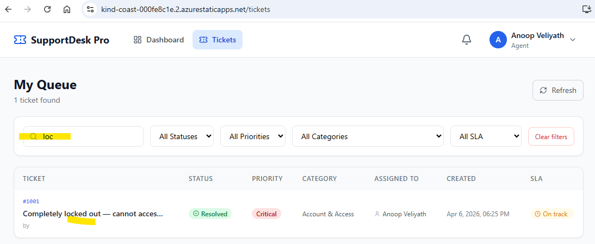

Request URL: https://supportdeskpro-api.victoriousdune-73ebad30.westus.azurecontainerapps.io/api/tickets?page=1&pageSize=20&search=loc

Request Method: GET

Response:
```
{
    "success": true,
    "data": {
        "items": [
            {
                "id": "ad0ae6df-035a-49a5-b3f6-84f8ee100051",
                "ticketNumber": 1001,
                "title": "Completely locked out - cannot access my account",
                "description": "I am completely locked out of my account since 9 AM this morning. \nI have tried logging in with",
                "status": "Resolved",
                "priority": "Critical",
                "categoryId": "c5e66bd3-b2d7-4977-a06c-29f3c79f25fd",
                "categoryName": "Account & Access",
                "customerId": "ca6a9df7-22bb-47ae-9880-6492d9320356",
                "customerName": "Andrea Maria",
                "assignedAgentId": "2a9a8871-46ea-416e-b58e-18ffa9324e11",
                "assignedAgentName": "Anoop Veliyath",
                "slaFirstResponseDueAt": "2026-04-06T19:25:06.16441",
                "slaResolutionDueAt": "2026-04-06T22:25:06.16441",
                "firstResponseAt": "2026-04-06T19:17:48.928761",
                "resolvedAt": "2026-04-06T22:25:25.2070075"
            }
        ]
    },
    "message": null,
    "errors": null,
    "pagination": null
}
```


